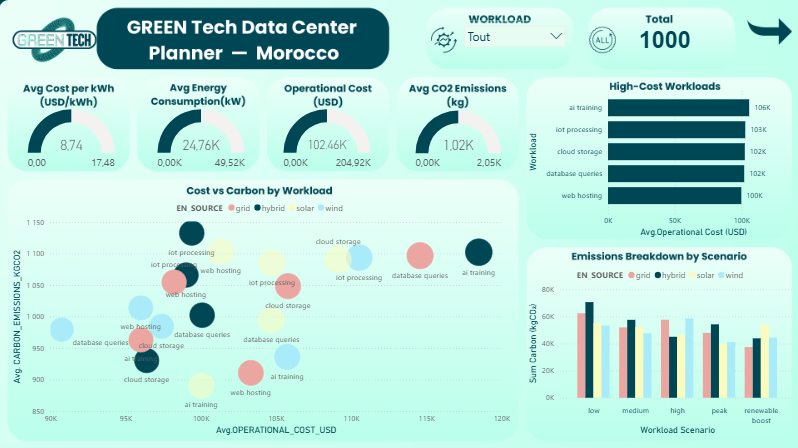
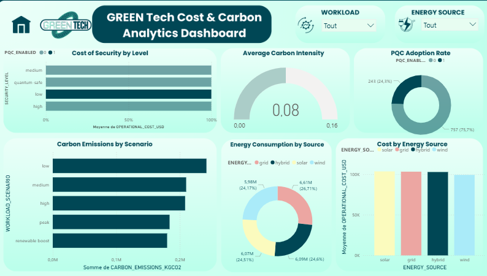

---

## Graphiques et visualisations utilisés

Le dashboard Power BI intègre plusieurs types de graphiques pour une analyse complète :

- **Cartes KPI** : Affichage instantané des indicateurs clés (coût total, énergie consommée, émissions de CO2 évitées).
- **Graphiques en barres** : Comparaison des coûts et consommations par site ou par période.
- **Courbes d’évolution** : Suivi temporel de la consommation énergétique et des émissions.
- **Diagrammes circulaires** : Répartition des sources d’énergie (renouvelable vs non renouvelable).
- **Segments interactifs** : Filtres dynamiques pour explorer les données par site, période, ou type d’énergie.

Chaque graphique est interactif et permet de croiser les dimensions pour une exploration approfondie des données Green IT.

---
---

## Aperçu du Dashboard Power BI

Voici un aperçu visuel du tableau de bord interactif développé :

*Page principale : Vue d’ensemble des indicateurs clés (KPI), consommation énergétique, coûts, et émissions de CO2.*

*Page secondaire : Analyse détaillée par site, période, et type d’énergie utilisée.*

---

# Power BI – Tableau de bord & Visualisation

## Présentation du projet & Accès sécurisé (WEP)

Ce projet BI s’inscrit dans l’initiative Green Tech pour la gestion intelligente et durable des data centers au Maroc. Le dashboard interactif est accessible en ligne via la plateforme WEP :

- **Accès au dashboard** : [https://wep-green-tech-site.vercel.app/projet](https://wep-green-tech-site.vercel.app/projet)
- **⚠️ Accès restreint** : Pour des raisons de sécurité, l’accès au code source du dashboard et aux données détaillées nécessite une autorisation. Merci de faire une demande d’accès auprès de l’équipe projet pour obtenir les droits nécessaires.

Le code source du projet est hébergé sur GitHub : [GREEN-IT-ORACLE-DATA-ENGINEERING](https://github.com/GREEN-IT-ORACLE-DATA-ENGINEERING)

---

Ce dossier contient les rapports et tableaux de bord Power BI créés à partir de la couche Gold du data lakehouse. L’objectif est de fournir des visualisations interactives pour analyser les coûts, la consommation énergétique, et les émissions de CO2 des data centers « Green IT ».

## Pourquoi utiliser Power BI ?
- **Analyse interactive** : Power BI permet d’explorer dynamiquement les données, d’identifier les tendances et de comparer différents scénarios (coût, énergie, émissions).
- **Partage et collaboration** : Les rapports peuvent être partagés facilement avec l’équipe projet et les parties prenantes.
- **Automatisation** : Rafraîchissement automatique des données depuis la couche Gold pour garantir l’actualité des analyses.

## Comment utiliser ce dossier ?
1. Ouvrir les fichiers Power BI (.pbix) disponibles ici (ou à ajouter).
2. Connecter la source de données à la couche Gold (voir documentation technique).
3. Personnaliser les visuels selon vos besoins d’analyse.
4. Publier ou partager le rapport via Power BI Service pour une collaboration en ligne.

## Design du projet (Canva)
Le design global du projet, incluant la charte graphique et la structure des dashboards, est disponible sur Canva :

[Lien vers le design Canva](https://www.canva.com/design/DAHBzyUfYek/to4YUyVkOwTvaIJuS1nLfw/edit?utm_content=DAHBzyUfYek&utm_campaign=designshare&utm_medium=link2&utm_source=sharebutton)

Ce design sert de référence pour harmoniser la présentation des rapports et garantir une identité visuelle cohérente à l’ensemble du projet.

## Idée d’utilisation avancée

Power BI peut également être utilisé pour la **prédiction et l’aide à la décision** concernant la création de nouveaux data centers au Maroc. En analysant les données historiques et les scénarios simulés (coûts, consommation, émissions, localisation), il est possible de fournir aux clients des recommandations personnalisées pour optimiser leurs investissements et réduire leur impact environnemental.

**Exemple d’application :**
- Comparer différents sites potentiels selon les critères énergétiques et financiers
- Visualiser l’impact environnemental de chaque scénario
- Générer des rapports d’aide à la décision pour les clients souhaitant investir dans des infrastructures Green IT au Maroc
